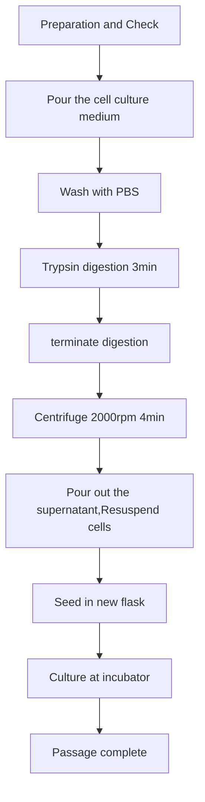

## Cell Passaging

### Purpose

1. Increase the number of cells
2. Avoid massive cell death due to entering the plateau or even decline phase

### Principle

When the proliferation of cultured cells reaches a certain density, **density inhibition** will occur, manifested as a gradual slowdown or even cessation of cell growth and division speed. Adherent cells will grow into a dense monolayer in the culture bottle (suspended cells will fill the entire volume of culture medium), covering the bottom of the culture bottle. If not packaged and cultured in a timely manner, i.e., subculturing, the cells will gradually deteriorate and die. Transferring the cultured cells from one container to another at an appropriate ratio to expand the culture is called subculturing.

### Instruments and reagents

1. Instruments: biosafety cabinet, desktop centrifuge, cell counter, CO2 incubator, inverted microscope, pipette, pipette, cell culture bottle.
2. Reagents: DMEM basic culture medium, bispecific antibody,FBS,PBS,Trypsin,75% alcohol.

### Method

> [!NOTE]
>
> For Adherent cell

1. Prepare **complete culture medium**  (DMEM basic medium+10% FBS+1% dual antibody, different complete culture media for different cells, MDA-MB-231 cells were used as an example in this experiment);

2. Take cells that have been cultured for **24 hours after recovery** and observe their cell density and growth status under a microscope. If the cell density reaches around 90%, it can be passaged;

3. Pour the cell culture medium into the waste liquid tank, add a small amount of PBS **along the side of the bottle**, **gently shake** the bottle to allow PBS to fully contact the cells, rinse and pour the PBS into the waste liquid tank. The remaining small amount of PBS is sucked clean with a gun;

4. Add trypsin that can cover the cells at the bottom of the culture bottle, put it in the incubator for digestion for about **3 minutes**, and observe the state under a microscope. It can be observed that the cells have dispersed into individual circles, gaps have appeared between cells, and move in a sandy shape, and are suspended in the culture medium.

5. Add complete culture medium to **terminate digestion**, repeatedly blow the bottom of the bottle and the cells to fully suspend them, and transfer them to a centrifuge tube. Wash the culture bottle again with a small amount of PBS and concentrate the two liquids into one tube;

6. Centrifuge the cells at 2000rpm for 4 minutes;

7. Pour out the supernatant of the centrifuged cell solution, gently tap the cell pellet to disperse it, first add 1mL of culture medium and mix well, then add 1mL of culture medium to dilute and mix thoroughly;

8. Count, draw 20 μ L of cell fluid, add 20 μ L of trypan blue staining solution, mix evenly, draw 20 μ L of the mixture and add it to the cell counting plate for counting. Calculate the required volume of cell fluid based on the seeding density;
     For example, if the concentration of live cells is 300w/mL and the dilution volume of cells is 2mL, the total number of cells is 300 × 2=600w. To achieve a cell concentration of 8w/cm2 in the T25 cell culture bottle, 200w of cells need to be aspirated, and the volume of aspirated cell solution is approximately 0.667mL (667 $μ$L): 200 ÷ 600 × 2;

9. Take 100 $μ$L of cell culture medium and add it to the D60 culture bottle. Add about 3.9mL of complete culture medium, gently shake back and forth, and **write** the cell name, culture generation, date, and name on the bottle body;

10. Place the culture bottle under a microscope to observe whether it has been shaken evenly. After confirming, place it in a culture box at 37 ℃, 5% CO2, and 90% humidity for cultivation;

     At this point, the cell passage experiment has been completed. 

> [!CAUTION]
>
> Alcohol spray before entering all operating areas
>
> Pls Attach Lable
