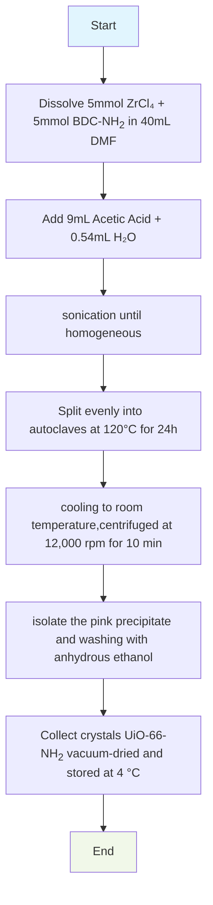
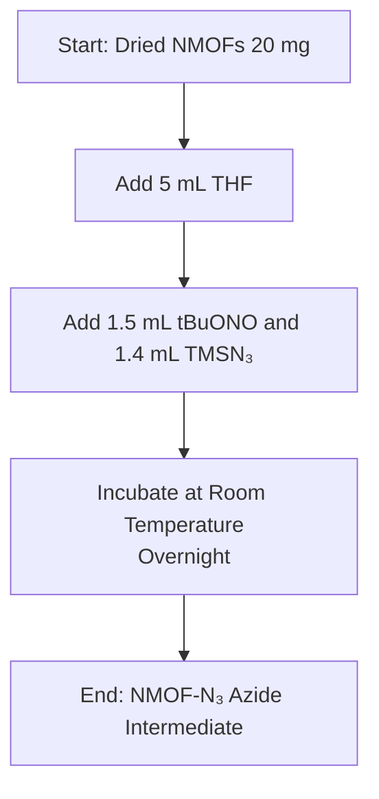

## Synthesis of UiO-66-NH2 and Azidation

UiO-66 is a crystal containing metal nodes composed of a **zirconium oxide** complex bridged by **terepthalic acid** ligands.

DMF （N,N-Dimethylformamide，N,N-二甲基甲酰胺）is a high boiling **polar aprotic** solvent, which can be miscible with water and most organic solvents, and can promote the SN2 reaction. It is one of the most commonly used solvents in organic synthesis.

是一种高沸点极性非质子溶剂，能和水以及大部分有机溶剂互溶，并且可以促使SN2反应的进行，是有机合成最常用的溶剂之一。

双分子亲核取代反应（SN2）是**亲核取代反应**的一类，其中S代表取代（Substitution），N代表亲核（Nucleophilic），2代表反应的决速步涉及两种分子。

H2BDC（Terephthalic acid， 对苯二甲酸）BDC-NH2   氨化对苯二甲酸

### Materials

UiO-66-NH2

| Component          | Quantity |
| ------------------ | -------- |
| ZrCl4   | 1.165g   |
| BDC-NH2 | 0.905g   |
| Ac                 | 9ml      |
| dH2O    | 0.54ml   |
| DMF                | 40ml     |

Azidation

| Material | Quantity |
| :--- | :--- |
| NMOFs(Dried) | 20 mg |
| Tetrahydrofuran (THF) | 5 mL |
| tert-Butyl nitrite (tBuONO) | 1.5 mL |
| Trimethylsilyl azide (TMSN₃) | 1.4 mL |

### Protocol

#### 1. autoclave

In details, 1.165 g of ZrCl4 and 0.905 g of BDC-NH2 were dissolved in 40 mL of DMF. Then 9 mL of acetic acid and 0.54 mL of deionized water were added into the above solution to sonication. Later, it was evenly transferred into five Teflon-lined steel autoclave (50 mL). The autoclave was maintained at 120 °C for 24 h.Upon cooling to room temperature, the mixture was centrifuged at 12,000 rpm for 10 min and subjected to several washes with anhydrous ethanol and deionized water to isolate the pink precipitate. The obtained UiO-66-NH2 was then vacuum-dried and stored at 4 °C

Teflon-lined steel autoclave铁氟龙内衬钢制高压釜

#### 2. Pluronic

将 F127（15 mg）和 NaClO4·H2O（（ 122.4 mg）充分溶解在3 mL 去离子水中，超声除去泡沫，然后加入包含 60 mg P123（（400 μL）的冰醋酸，继续超声分散均匀，再向体系内加入3 mL TMB，通过继续超声分散后形成乳白色的悬浊液。随即将整个反应体系置于油浴锅内并在 40 ℃下搅拌 1 h。最后向悬浊液中加入161 mg ZrClO4·8H2O 和50 mg BDC-NH2，再继续搅拌反应 12 h。粗产物经 DMF 和乙醇各离心洗涤三次后，再用去离子水洗涤，所得产物最后均匀分散在水中标记为 UiO-66-NH2，保存于 4 ℃冰箱内备用。

泊洛沙姆（Poloxamer）泊洛沙姆（Poloxamer）商品名为普兰尼克（Pluronic），是一类新型的高分子非离子表面活性剂，分子式是HO·(C2H4O)m·(C3H6O)n·H，为聚氧乙烯聚氧丙烯醚嵌段共聚物。Pluronic® F-127具有温敏性的三嵌段共聚物，在低温下为液体、在体温附近形成凝胶，广泛用于药物递送和细胞培养。Pluronic® P-123是亲油性较强的三嵌段共聚物，主要用作高效乳化剂和模板剂，常用于制备介孔材料和工业清洗。

#### Azidation

THF（Tetrahydrofuran，四氢呋喃）tBuONo （Tert-butyl nitrite，亚硝酸特丁酯）

强力氮化剂tBuONO,TMSN（Trimethylsilyl cyanide，三甲基氰硅烷）

Synthesis of NMOFs with Azide Group (NMOF-N,): The dried NMOFs (20 mg) were put into a vial with 5 mL of THF, Then 1.5 ml of the tBuONo and 1.4 mL of the TMSN, were added. Themixture was incubated at room temperature overnight to produce the azide intermediatecorresponding compound (NMOF-N3).

