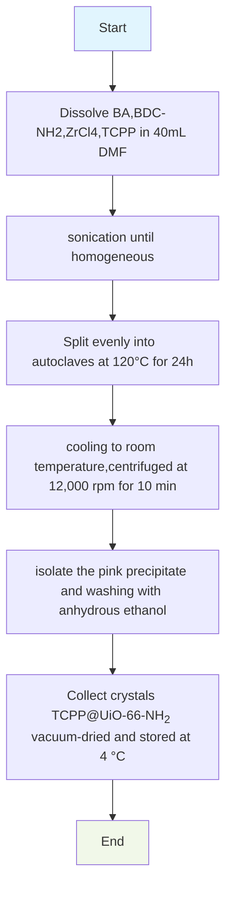

## Synthesis of TCPP@UiO-66-NH2

TCPP（Tetrakis (4-carboxyphenyl) porphyrin (TCPP)，中-四(4-羧基苯基)卟吩）卟啉是常见的光敏剂，因为它们在 400-450 nm 区域（Soret 波段）具有非常强的吸收力，并在 500-700 nm 区域（Q 波段）具有非常强的吸收力。

Porphyrins are organic compounds with a basic structure of four pyrroles and, in some cases, a coordinated metal ion. Porphyrins have long been known to have an affinity for neoplastic tissue, which has led to their use in cancer diagnosticsand cancer therapeutics such as photodynamic therapy (PDT)[(2021 the FASEB Journal)](https://doi.org/10.1096/fj.202000197R)

### Protocol

#### 90℃

| Component                         | amount |
| --------------------------------- | ------ |
| TCPP                              | 6 mg   |
| BDC-NH2                | 180 mg |
| BA                                | 2.4 g  |
| ZrOCl2·8H2O | 240 mg |
| DMF                               | 36 ml  |

90℃ 2.5h、90℃ 4h

Use the same method as 120 ℃，but  2.5 h use direct heating method

#### 120℃ + 12h  <200nm

- BA 2500mg
- BDC-NH2 150mg
- ZrCl4 150 mg
- H2TCPP 50 mg
- DMF 10ml 

120 ℃ 12h

Zr-NH2-BDC/TCPP (TCPP@UiO-66-NH2) was synthesized depending on the literature. 150 mg ZrCl4, 2.5g benzoic acid, 150 mg NH2-BDC, and 50 mg TCPP were dissolved in 10 mL DMF. The purple liquid was sonicated for 30 min and then put into the Teflon-lined autoclave at 120 °C for 12 h. Then, the solid products were cleaned with DMF and EtOH and vacuum-dried. The **purple** solid product was collected.[(FOOD CHEM.)](https://doi.org/10.1016/j.foodchem.2024.140198)

